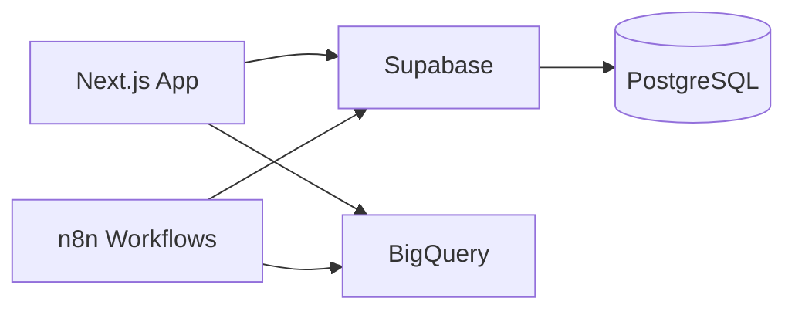

# Git Workflow & Project Setup

## Table of Contents
- [1. Conventional Commits](#1-conventional-commits)
- [2. Commit Convention Enforcement](#2-commit-convention-enforcement)
- [3. Changelog Automation](#3-changelog-automation)
  - [Option A: semantic-release (recommended for single packages)](#option-a-semantic-release-recommended-for-single-packages)
  - [Option B: Changesets (for monorepos)](#option-b-changesets-for-monorepos)
- [4. Branch Strategy](#4-branch-strategy)
  - [Trunk-Based (solo / small team) — RECOMMENDED](#trunk-based-solo--small-team--recommended)
  - [Git Flow (larger teams)](#git-flow-larger-teams)
- [5. README Template](#5-readme-template)
- [6. `.env.example` Template](#6-envexample-template)
- [7. Branch Protection Rules](#7-branch-protection-rules)

## 1. Conventional Commits

**Format:** `type(scope): description`

| Type       | Purpose                          | Version Bump |
|------------|----------------------------------|-------------|
| `feat`     | New feature                      | MINOR       |
| `fix`      | Bug fix                          | PATCH       |
| `chore`    | Maintenance, deps                | none        |
| `docs`     | Documentation only               | none        |
| `refactor` | Code change, no feature/fix      | none        |
| `test`     | Adding/fixing tests              | none        |
| `style`    | Formatting, whitespace           | none        |
| `perf`     | Performance improvement          | PATCH       |
| `ci`       | CI/CD changes                    | none        |

**Breaking changes:**
```
feat!: remove legacy API endpoints

BREAKING CHANGE: The /api/v1/* endpoints have been removed.
Migrate to /api/v2/* before upgrading.
```

**Examples:**
```bash
feat(auth): add magic link login
fix(dashboard): correct chart date range calculation
chore(deps): bump next to 15.2
refactor(api): extract validation middleware
perf(queries): add index for user lookup
ci: add preview deployment workflow
```

## 2. Commit Convention Enforcement

```bash
# Install commitlint + husky
bun add -d @commitlint/cli @commitlint/config-conventional husky
bunx husky init
```

```javascript
// commitlint.config.js
export default {
  extends: ["@commitlint/config-conventional"],
  rules: {
    "type-enum": [
      2,
      "always",
      ["feat", "fix", "chore", "docs", "refactor", "test", "style", "perf", "ci"],
    ],
    "subject-case": [2, "never", ["upper-case", "pascal-case"]],
    "header-max-length": [2, "always", 100],
  },
};
```

```bash
# .husky/commit-msg
bunx --no -- commitlint --edit $1
```

**Optional lint-staged for pre-commit:**

```bash
bun add -d lint-staged
```

```json
// package.json (partial)
{
  "lint-staged": {
    "*.{ts,tsx}": ["eslint --fix", "prettier --write"],
    "*.{json,md,yml}": ["prettier --write"]
  }
}
```

```bash
# .husky/pre-commit
bunx lint-staged
```

## 3. Changelog Automation

### Option A: semantic-release (recommended for single packages)

```json
// .releaserc.json
{
  "branches": ["main"],
  "plugins": [
    "@semantic-release/commit-analyzer",
    "@semantic-release/release-notes-generator",
    "@semantic-release/changelog",
    [
      "@semantic-release/npm",
      { "npmPublish": false }
    ],
    [
      "@semantic-release/git",
      {
        "assets": ["CHANGELOG.md", "package.json"],
        "message": "chore(release): ${nextRelease.version} [skip ci]"
      }
    ],
    "@semantic-release/github"
  ]
}
```

```yaml
# .github/workflows/release.yml
name: Release

on:
  push:
    branches: [main]

permissions:
  contents: write
  issues: write
  pull-requests: write

jobs:
  release:
    runs-on: ubuntu-latest
    steps:
      - uses: actions/checkout@v4
        with:
          fetch-depth: 0
          persist-credentials: false

      - uses: oven-sh/setup-bun@v2

      - run: bun install --frozen-lockfile

      - name: Release
        env:
          GITHUB_TOKEN: ${{ secrets.GITHUB_TOKEN }}
        run: bunx semantic-release
```

### Option B: Changesets (for monorepos)

```bash
bun add -d @changesets/cli @changesets/changelog-github
bunx changeset init
```

```json
// .changeset/config.json
{
  "$schema": "https://unpkg.com/@changesets/config@3.0.0/schema.json",
  "changelog": ["@changesets/changelog-github", { "repo": "user/repo" }],
  "commit": false,
  "access": "restricted",
  "baseBranch": "main"
}
```

## 4. Branch Strategy

### Trunk-Based (solo / small team) — RECOMMENDED

```
main ──────●────●────●────●────●──────
            \       /      \      /
  feat/auth  ●──●──●   fix/bug ●
```

- `main` is always deployable
- Short-lived feature branches (1-3 days max)
- Merge via squash or rebase
- Tags for releases

### Git Flow (larger teams)

```
main    ────●─────────────────●────
             \               /
develop ──●───●───●───●───●──●────
           \     /     \   /
  feat/x    ●──●    feat/y ●
```

**Branch naming:**
```
feat/add-dashboard-filters
fix/chart-timezone-offset
chore/update-dependencies
docs/api-reference
```

## 5. README Template

````markdown
<div align="center">
  
  <h1>Project Name</h1>
  <p>One-line description of what this project does.</p>

  
  
  
</div>

---

## Features

- Feature one with brief explanation
- Feature two with brief explanation
- Feature three with brief explanation

## Quick Start

```bash
git clone https://github.com/user/repo.git
cd repo
cp .env.example .env.local
bun install
bun run dev
```

Open [http://localhost:3000](http://localhost:3000).

## Architecture



## Project Structure

```
src/
  app/           # Next.js App Router pages
  components/    # React components
    ui/          # shadcn/ui primitives
  lib/           # Utilities, clients, helpers
  server/        # Server-only code (actions, queries)
  types/         # TypeScript type definitions
```

## Environment Variables

| Variable | Required | Description |
|----------|----------|-------------|
| `NEXT_PUBLIC_SUPABASE_URL` | Yes | Supabase project URL |
| `NEXT_PUBLIC_SUPABASE_ANON_KEY` | Yes | Supabase anon key |
| `SUPABASE_SERVICE_ROLE_KEY` | Yes | Supabase service role key |
| `DATABASE_URL` | Yes | Direct PostgreSQL connection |

## Scripts

| Command | Description |
|---------|-------------|
| `bun run dev` | Start development server |
| `bun run build` | Production build |
| `bun run lint` | Run ESLint |
| `bun run type-check` | Run TypeScript compiler check |
| `bun run test` | Run tests |
| `bun run db:generate` | Generate Drizzle migrations |
| `bun run db:migrate` | Run Drizzle migrations |

## Tech Stack

- **Framework:** Next.js 15 (App Router)
- **Language:** TypeScript
- **Styling:** Tailwind CSS + shadcn/ui
- **Database:** Supabase (PostgreSQL)
- **ORM:** Drizzle
- **Package Manager:** Bun
- **Deployment:** Vercel

## Contributing

1. Fork the repository
2. Create a feature branch (`feat/amazing-feature`)
3. Commit with conventional commits
4. Open a Pull Request

## License

MIT
````

## 6. `.env.example` Template

```bash
# .env.example
# Copy to .env.local and fill in values:  cp .env.example .env.local

# ============================================================
# App
# ============================================================
NEXT_PUBLIC_APP_URL=http://localhost:3000        # required
NEXT_PUBLIC_APP_NAME="My App"                    # required

# ============================================================
# Supabase
# ============================================================
NEXT_PUBLIC_SUPABASE_URL=                        # required — https://xxx.supabase.co
NEXT_PUBLIC_SUPABASE_ANON_KEY=                   # required
SUPABASE_SERVICE_ROLE_KEY=                       # required — server-only
DATABASE_URL=                                    # required — postgres://...

# ============================================================
# Auth (optional providers)
# ============================================================
# GOOGLE_CLIENT_ID=                              # optional
# GOOGLE_CLIENT_SECRET=                          # optional

# ============================================================
# Tracking (optional)
# ============================================================
# NEXT_PUBLIC_GTM_ID=GTM-XXXXXXX                 # optional
# META_PIXEL_TOKEN=                              # optional — server CAPI
# META_PIXEL_ID=                                 # optional

# ============================================================
# AI / LLM
# ============================================================
# OPENAI_API_KEY=sk-...                          # optional
# ANTHROPIC_API_KEY=sk-ant-...                   # optional
```

## 7. Branch Protection Rules

```bash
# Set up branch protection via GitHub CLI
gh api repos/{owner}/{repo}/rulesets --method POST --input - <<'EOF'
{
  "name": "Protect main",
  "target": "branch",
  "enforcement": "active",
  "conditions": {
    "ref_name": {
      "include": ["refs/heads/main"],
      "exclude": []
    }
  },
  "rules": [
    {
      "type": "pull_request",
      "parameters": {
        "required_approving_review_count": 1,
        "dismiss_stale_reviews_on_push": true,
        "require_last_push_approval": false
      }
    },
    {
      "type": "required_status_checks",
      "parameters": {
        "strict_required_status_checks_policy": true,
        "required_status_checks": [
          { "context": "ci" }
        ]
      }
    },
    {
      "type": "non_fast_forward"
    }
  ]
}
EOF
```

**Quick setup summary:**
- Require at least 1 PR review before merge
- Require CI status check to pass
- No force push to main (non_fast_forward rule)
- Dismiss stale reviews when new commits are pushed
