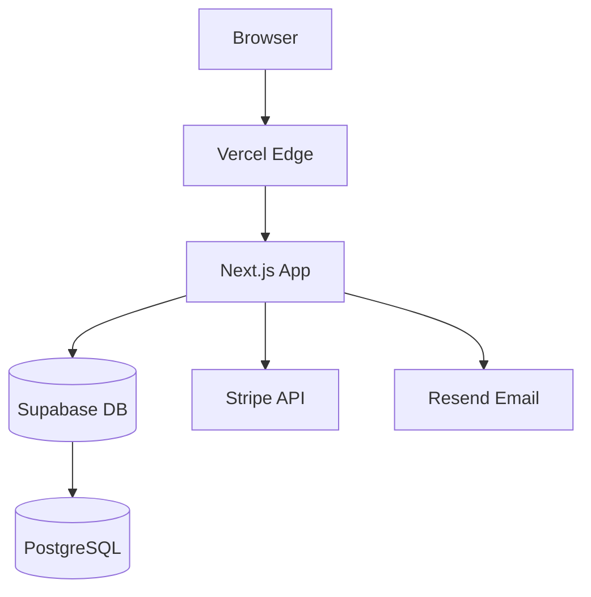

# PROJECT-CONCEPT.md Template

Use this template during Phase 0 (Discovery & Concept) to capture all project requirements before writing any code.

---

```markdown
# PROJECT-CONCEPT.md

> Last updated: YYYY-MM-DD | Status: DRAFT / APPROVED

---

## 1. Project Overview

| Field             | Value                                          |
| ----------------- | ---------------------------------------------- |
| Project Name      | [e.g., Dalina Dashboard]                       |
| One-Line Summary  | [What it does in one sentence]                 |
| Problem Statement | [What pain point does this solve? For whom?]   |
| Project Type      | [SaaS / Landing Page / Internal Tool / E-Commerce / Dashboard] |
| Timeline          | [Target launch date or sprint count]           |
| Budget            | [Dev hours, infrastructure costs, SaaS tools]  |

---

## 2. Target Users

### Primary Persona
- **Name:** [e.g., "Marketing Maria"]
- **Role:** [e.g., Performance Marketing Manager at a DACH agency]
- **Pain:** [e.g., spends 4 hours/week compiling KPI reports manually]
- **Goal:** [e.g., automated weekly reports with AI insights]
- **Tech Comfort:** [Low / Medium / High]

### Secondary Persona
- **Name:** [e.g., "CEO Carl"]
- **Role:** [e.g., Agency owner reviewing high-level numbers]
- **Needs:** [e.g., executive summary, trend arrows, no data entry]

### Anti-Persona (Who This Is NOT For)
- [e.g., Enterprise companies with 500+ employees needing SOC2 compliance]
- [e.g., Users who need real-time bidding automation]

---

## 3. Goals & Success Metrics

| Goal                    | KPI                        | Target          | Timeframe  |
| ----------------------- | -------------------------- | --------------- | ---------- |
| [User acquisition]      | [Monthly signups]          | [100/month]     | [Month 3]  |
| [Retention]             | [30-day retention rate]    | [40%]           | [Month 6]  |
| [Revenue]               | [MRR]                      | [5,000 EUR]     | [Month 6]  |
| [Performance]           | [Lighthouse score]         | [> 90]          | [Launch]   |

---

## 4. Scope (MoSCoW)

### Must Have (MVP)
- [ ] [e.g., User authentication with email/password]
- [ ] [e.g., Dashboard with 3 core KPI widgets]
- [ ] [e.g., Data import from Google Ads API]
- [ ] [e.g., Responsive design (mobile + desktop)]

### Should Have (Post-MVP, high priority)
- [ ] [e.g., PDF export of reports]
- [ ] [e.g., Team member invitation]
- [ ] [e.g., Slack notifications]

### Could Have (Nice to have)
- [ ] [e.g., Dark mode]
- [ ] [e.g., Custom dashboard layouts]
- [ ] [e.g., AI-generated recommendations]

### Won't Have (Explicitly out of scope)
- [ ] [e.g., Mobile native app]
- [ ] [e.g., White-label support]
- [ ] [e.g., Multi-language i18n (German only for MVP)]

---

## 5. User Flows

### Critical Path: [e.g., Signup to First Dashboard]

```
Landing Page → Click "Start Free Trial"
  → Signup Form (email, password, company name)
  → Email Verification
  → Onboarding Wizard (connect data source)
  → Dashboard with first data loaded
```

### Secondary Flow: [e.g., Invite Team Member]

```
Settings → Team → Invite Member
  → Enter email, select role
  → Invitation email sent
  → Invitee clicks link → Signup (pre-filled) → Joins workspace
```

---

## 6. Technical Architecture

| Layer          | Choice                    | Rationale                              |
| -------------- | ------------------------- | -------------------------------------- |
| Framework      | Next.js (App Router)      | SSR, API routes, Vercel deployment     |
| Language       | TypeScript                | Type safety, better DX                 |
| Styling        | Tailwind CSS + shadcn/ui  | Rapid UI development                   |
| Database       | Supabase (PostgreSQL)     | RLS, real-time, auth built-in          |
| Auth           | Supabase Auth             | Email/password, OAuth, RLS integration |
| Hosting        | Vercel                    | Zero-config Next.js deployment         |
| File Storage   | Supabase Storage          | Integrated with auth/RLS               |
| Email          | Resend                    | Developer-friendly, React Email        |
| Payments       | Stripe                    | Industry standard, DACH support        |
| Monitoring     | Sentry                    | Error tracking, performance            |
| Analytics      | PostHog / Plausible       | Privacy-friendly, EU-hosted options    |

### Architecture Diagram (Mermaid)



---

## 7. Data Model

### Core Entities

| Entity         | Key Fields                                    | Relations                |
| -------------- | --------------------------------------------- | ------------------------ |
| User           | id, email, name, role, created_at             | has many Projects        |
| Project        | id, name, user_id, settings                   | belongs to User          |
| DataSource     | id, project_id, type, credentials, status     | belongs to Project       |
| Report         | id, project_id, date_range, data, created_at  | belongs to Project       |

---

## 8. Design Direction

| Aspect          | Direction                                              |
| --------------- | ------------------------------------------------------ |
| Mood            | [Professional but approachable / Bold and modern / ...]|
| Color Palette   | [Primary: #2563EB, Neutral: Slate, Accent: #F59E0B]   |
| Fonts           | [Heading: Inter, Body: Inter, Mono: JetBrains Mono]   |
| Animation Level | [Subtle: page transitions, micro-interactions only]    |
| Icon Style      | [Lucide icons, consistent 24px stroke width]           |
| References      | [URL1, URL2, URL3 — sites with desired look/feel]     |
| Dark Mode       | [Yes / No / Later]                                     |

---

## 9. Third-Party Integrations

| Service         | Purpose                  | Pricing              | Priority  |
| --------------- | ------------------------ | -------------------- | --------- |
| [Stripe]        | [Payments]               | [2.9% + 0.30 EUR]   | [Must]    |
| [Resend]        | [Transactional email]    | [Free up to 3k/mo]  | [Must]    |
| [PostHog]       | [Product analytics]      | [Free up to 1M]     | [Should]  |
| [Sentry]        | [Error monitoring]       | [Free up to 5k]     | [Must]    |

---

## 10. Non-Functional Requirements

| Category        | Requirement                                            |
| --------------- | ------------------------------------------------------ |
| Performance     | LCP < 2.5s, FID < 100ms, CLS < 0.1                   |
| Security        | OWASP Top 10, RLS on all tables, rate limiting         |
| Accessibility   | WCAG 2.1 AA (EAA compliance required since June 2025) |
| Browser Support | Chrome, Firefox, Safari, Edge (last 2 versions)        |
| Uptime          | 99.9% target                                           |
| Scalability     | Support up to 1,000 concurrent users at launch         |

---

## 11. Legal & Compliance

- [ ] Impressum (DDG-compliant, reachable within 2 clicks)
- [ ] Datenschutzerklaerung (generated via Datenschutz-Generator.de)
- [ ] Cookie Consent (Google Consent Mode v2, TCF 2.3)
- [ ] GDPR Art. 17 deletion endpoint
- [ ] Data export endpoint (EU Data Act)
- [ ] AGB / Terms of Service
- [ ] AVV / DPA for B2B customers
- [ ] EAA / BFSG accessibility compliance

---

## 12. Tracking & Marketing

| Tool             | Purpose                | Implementation              |
| ---------------- | ---------------------- | --------------------------- |
| [GA4]            | [Web analytics]        | [Via GTM, Consent Mode v2]  |
| [Meta Pixel]     | [Retargeting]          | [Consent-gated]             |
| [Google Ads]     | [Conversion tracking]  | [Server-side preferred]     |
| [KlickTipp]      | [Email marketing]      | [Double opt-in forms]       |

---

## 13. Environment Strategy

| Environment | URL                          | Purpose                    | Data        |
| ----------- | ---------------------------- | -------------------------- | ----------- |
| DEV         | localhost:3000               | Local development          | Seed data   |
| STAGING     | staging.project.com          | QA, client preview         | Anonymized  |
| PROD        | app.project.com              | Production                 | Real data   |

- Feature flags: [PostHog / Vercel Edge Config / custom]
- CI/CD: GitHub Actions → Vercel (auto-deploy on push to main)
- Branch strategy: main (prod), develop (staging), feature/* (dev)

---

## 14. Decision Log

| Date       | Decision                    | Options Considered          | Chosen      | Rationale                          |
| ---------- | --------------------------- | --------------------------- | ----------- | ---------------------------------- |
| YYYY-MM-DD | [Database provider]         | [Supabase, PlanetScale, Neon] | [Supabase] | [RLS, auth, real-time built-in]   |
| YYYY-MM-DD | [Auth method]               | [NextAuth, Clerk, Supabase] | [Supabase]  | [Already using Supabase DB]       |

---

## 15. Open Questions

| #  | Question                                        | Owner     | Deadline   | Status |
| -- | ----------------------------------------------- | --------- | ---------- | ------ |
| 1  | [Which payment plans? Free tier?]               | [Name]    | [Date]     | Open   |
| 2  | [Do we need SSO for enterprise customers?]      | [Name]    | [Date]     | Open   |
| 3  | [Custom domain support for white-label?]        | [Name]    | [Date]     | Open   |

---

## 16. Questions PMs Always Ask

Answer these before starting development to prevent scope creep and missed requirements:

1. **What happens when the user has no data yet?** — Empty states for every list, dashboard, and table.
2. **What does the error state look like?** — API failures, network errors, validation errors.
3. **Who pays, and how?** — Free trial length, payment plans, upgrade/downgrade flow, failed payment handling.
4. **What emails does the system send?** — Verification, welcome, password reset, invoice, notifications, cancellation.
5. **What are the user roles and permissions?** — Admin, member, viewer — what can each role see and do?
6. **How does onboarding work?** — First-time user experience, wizard, tooltips, sample data.
7. **What gets logged and where?** — Audit trail, analytics events, error logs.
8. **What is the data backup and recovery strategy?** — Supabase PITR, export frequency, RTO/RPO.
9. **How do users get support?** — Help center, chat widget, email, phone.
10. **What are the hard launch blockers vs. nice-to-haves?** — Revisit MoSCoW and be ruthless.
```
